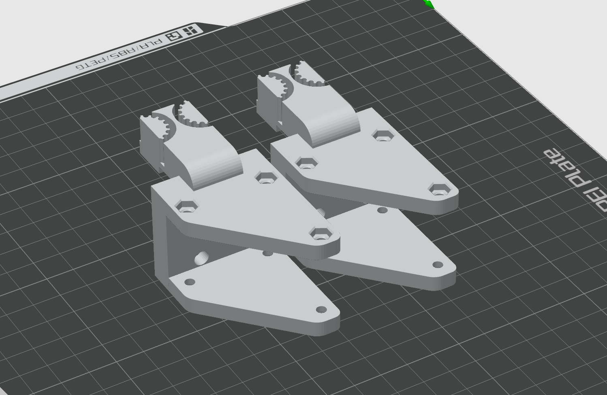
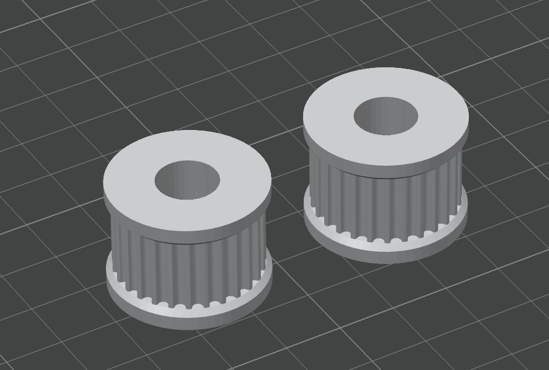
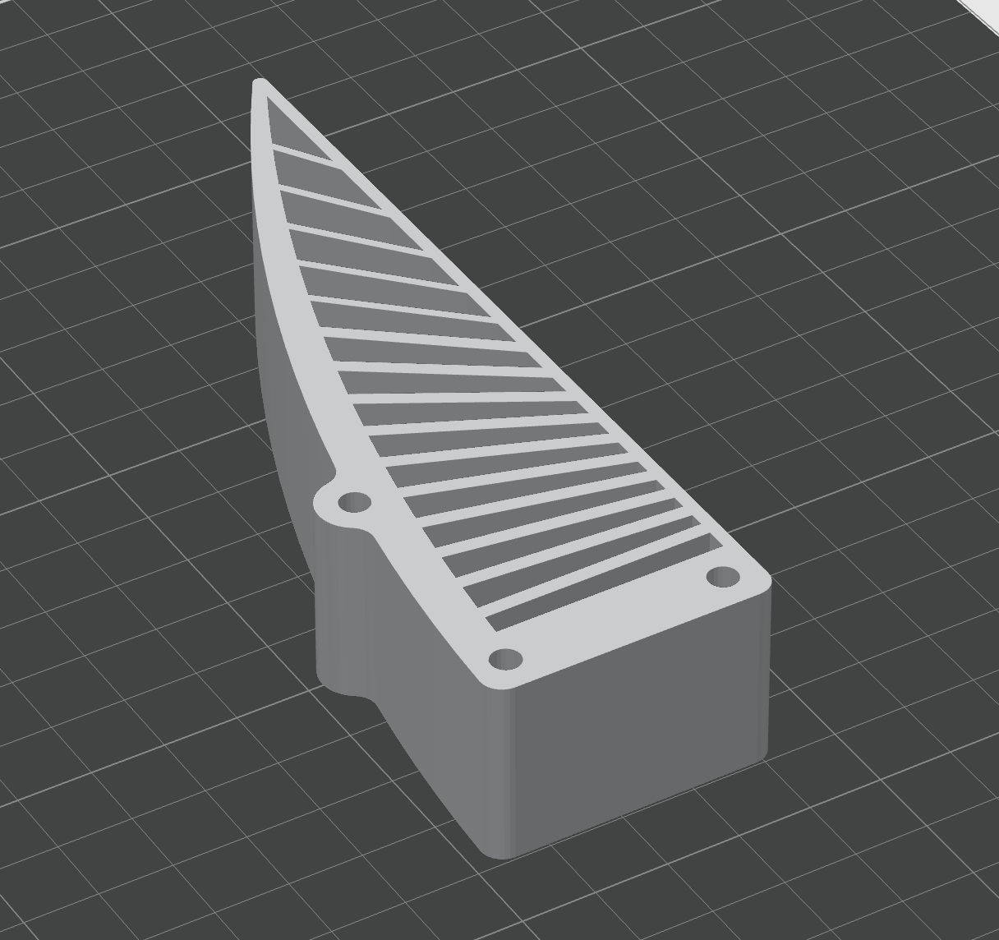
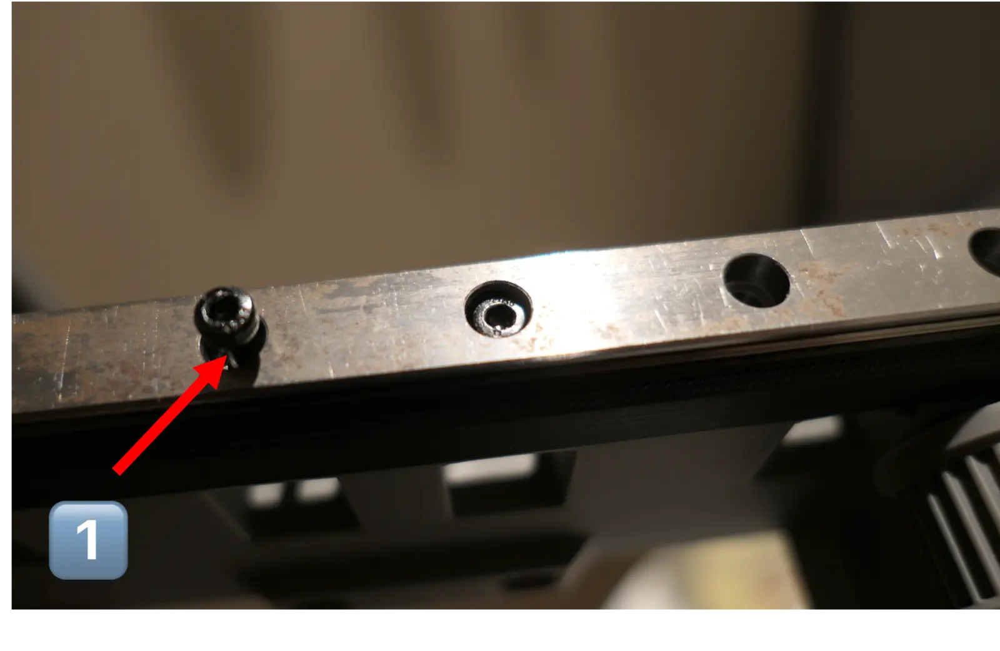
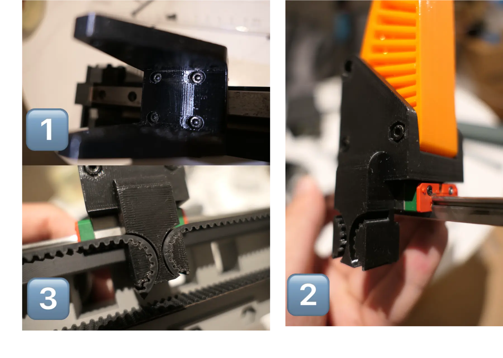

# 机械设计与装配

当前 HLS3950 机械适配已在 [Onshape CAD](https://cad.onshape.com/documents/6b62f8794d0bbb7b41c1c997/w/e1534e929e40aaacf2109eb3/e/1d43023ae86ad55792d145ee) 中基本完成，待实物尺寸复核、打印和装配验证。当前基准型号为 `HLS3950M-C001`，官网商品页也写作 `HL-3950-C001`。同外形尺寸 `45.22 mm × 24.72 mm × 35 mm` 且安装、输出轴、通信和供电接口匹配的飞特舵机也可作为机械候选，例如 `ST-3250-C001`、`ST-3235-C001` 和 `HL-3930-C001`。

## 已实施变更

| 部位 | 当前设计 | 样机检查重点 |
| --- | --- | --- |
| 安装基体 | 按 HLS3950 安装孔位重新绘制 | 孔距、输出轴中心、出线空间和结构强度 |
| 主动轮 | 4 个 M3 孔，孔中心半径 7mm，PCD 14mm | 螺丝长度、避空、防松和同轴度 |
| 从动轮轴 | 5mm × 35mm 光杆、M4 螺纹塞打螺栓 | 光杆覆盖轴承承载区，螺纹不接触轴承工作面 |

还需确认机械限位、皮带张紧量、动力配电安装位，以及舵机和线束与机器人法兰、相机支架的全行程干涉。

## 复用范围

原 XL430 项目的以下内容可作为首版样机参考：

| 内容 | 处理 |
| --- | --- |
| MGN12H 导轨、滑块、指尖支架和 TPU 指尖 | 原则上复用，装配后检查干涉 |
| HTD3M 皮带、从动轮和 F685-2RS 轴承 | 保持传动中心距时复用，最终长度需复核 |
| 指尖、滑块和皮带装配顺序 | 可参考，张紧量和行程需重新验证 |
| 原基体、XL430 主动轮、圆柱销装配和 OpenRB 接线 | 不复用 |

## 打印与装配参考

刚性零件可先用 PLA、PETG 或 ABS，指尖使用 TPU 95A。HLS3950 新基体和主动轮的材料、层方向和填充率需通过样机试验确定。

从动轮本体可参考，轴和安装方式以当前塞打螺栓方案为准。

装配后检查导轨螺丝不进入滑块行程，皮带全行程无跳齿、跑偏和干涉。

## 发布前检查

1. 使用 HLS3950 实物复核安装孔、输出轴中心和连接器空间。
2. 确认主动轮、从动轮和皮带夹持点共面，并保留张紧调节量。
3. 确认塞打螺栓光杆覆盖轴承承载区。
4. 验证左右滑块全行程和实体机械限位。
5. 导出完整装配至 `hardware/cad/hls3950_gripper.step`（当前待生成），并将新增打印件导出到 `hardware/print_parts/`。

## 来源限制

参考 STEP、STL 和图片来自 [`Shua-Kang/force_gripper_hardware`](https://github.com/Shua-Kang/force_gripper_hardware) 提交 `ff68bf4fce071ca1d055616c89dba56ccfd226d8`。原仓库没有明确许可证；这些参考资料不受本仓库 Apache-2.0 许可覆盖。公开发布衍生模型或图片前需取得作者授权，或替换为本项目自行生成的资料。图片对应关系见 `docs/assets/force_gripper_hardware/PROVENANCE.txt`。
