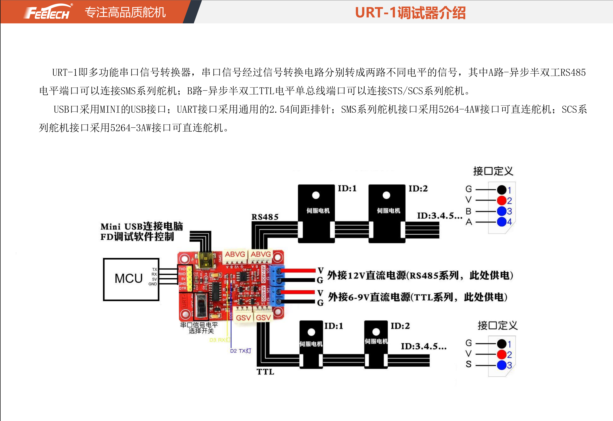
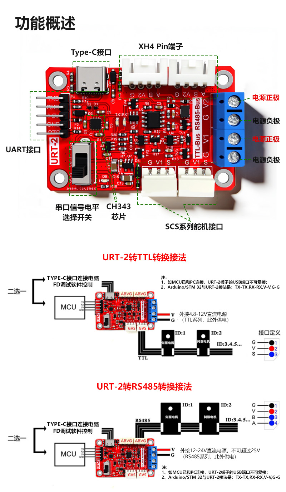

# URT-1 与 HLS3950 接线

当前台架通过 USB 连接电脑与飞特 `URT-1`，舵机使用 TTL 总线。数据线接口按实际总线板选择；URT-1 常见为 Mini USB，URT-2 常见为 USB-C。

## 接口识别

URT-1 的 TTL 舵机接口为 `G / S / V`，对应 HLS3950 的 `GND / Signal / Vcc`。当前已实践验证的接法是把
`12V` 电源接入 URT-1 上给 TTL 系列供电的 `DC6V-9V` / `V1` 端子，再通过 TTL 口把 `G / S / V` 一并接到 HLS3950。



飞特 URT-1 调试器接口介绍。

URT-2 可作为同类 USB 总线板候选，接口识别时同样应以板上丝印和对应产品资料为准。



来源：飞特官网产品图（本地镜像位于 `docs/assets/`）。

URT-1 关键接口如下：

| URT-1 标识 | 用途 | HLS3950 是否使用 |
| --- | --- | --- |
| Mini USB | 电脑 USB 串口 | 使用 |
| `G / S / V` | TTL 单线总线接口 | 当前接 `G / S / V` 到 HLS3950 |
| `G / V2 / B / A` | RS485 总线接口 | 禁止用于该 TTL 型 HLS3950 |
| `DC6V-9V` / `DC5V-9V` | V1，TTL 系列动力输入 | 当前作为 HLS3950 的 12V 供电入口使用 |
| `8V-24V` / `9V-24V` | RS485 系列供电输入端子 | 当前不用于该 TTL 型 HLS3950 |
| `3V3 / 5V` 开关 | 通信逻辑电平选择 | 当前按 5V |

HLS3950M-C001 官方规格书确认：

- 连接器：`5264-3P`；
- 引脚 1：GND；
- 引脚 2：Vcc；
- 引脚 3：Signal/TTL；
- 工作电压：9V 至 12.6V；
- 信号高电平：2V 至 5V；
- 信号低电平：0V 至 0.45V；
- 默认波特率：1 Mbps；
- 默认 ID：1。

不要只按线色连接，必须核对 URT-1 丝印和舵机规格书。URT-1 的 `3V3 / 5V`
开关只影响 TTL 信号电平，不是舵机供电电压；当前按 5V TTL 连接以获得更大
信号裕量，使用 URT-2 或其他总线板时应按板卡资料和实测通信稳定性确认。

## 12V 外部供电

当前按你已验证的原型接法，`12V` 电源直接接入 URT-1 上给 TTL 系列供电的
`DC6V-9V` / `V1` 端子，再由 TTL 接口的 `G / S / V` 连接 HLS3950。`8V-24V` /
`9V-24V` 端子按当前理解用于 RS485 系列供电，不作为本 TTL 型 HLS3950 的供电入口。
尽管板上 TTL 侧丝印常见为 `DC6V-9V` 或 `DC5V-9V`，你当前样机已验证可接 `12V`
电源；后续仍需结合官方资料和持续温升实测确认长期使用边界。官方说明同时提到
URT-1 的电源端口有过流限制，最大约 `6A`；当前两台 HLS3950 台架验证可以这样接，
后续若增加负载或需要更强保护，再增加独立配电与支路保护。

```text
电脑 USB ───────────────────── URT-1 Mini USB

12V 电源正极 ───────────────── URT-1 DC6V-9V / V1 +
12V 电源负极 ───────────────── URT-1 DC6V-9V / V1 -

URT-1 G ────────────────────── HLS3950 GND
URT-1 S ────────────────────── HLS3950 Signal/TTL
URT-1 V ────────────────────── HLS3950 Vcc
```

两台舵机并联 `GND/Vcc/Signal`，ID 分别设为 1 和 2。建议使用至少 `12V 6A` 的稳压电源，并为各舵机支路增加保险或电子限流；两台舵机官方堵转电流合计约 4.8A。

## 上电顺序

1. 断电状态下检查 `GND/Vcc/Signal` 和电源极性。
2. 确认 URT-1 逻辑电平开关位置；当前按 5V TTL 连接。
3. 初始接线仅连接一台舵机，并确保舵机没有连接夹爪传动机构。
4. 接通舵机电源，确认无异常发热、异味或大电流。
5. 再连接 USB 到电脑，查找串口设备。
6. 先执行只读 `ping`，成功后读取当前位置、电压和温度。
7. 关闭程序、USB 和舵机电源后再改线或增加第二台舵机。

Linux 下可使用以下命令查找稳定设备名：

```bash
ls -l /dev/serial/by-id/
```

初始程序只做 ID 1、1 Mbps 的 `ping` 和只读反馈，不运行运动示例。

## 仍需实测

- URT-1 在双机 1 Mbps 条件下的通信错误率；
- 外部 12V 共地接线下的信号波形；
- 双机位置和电流反馈的持续采样频率；
- URT-1 接口保护和长期温升。

## 官方资料

- [HLS3950 官方产品页](https://www.feetechrc.com/563788.html)
- [HLS3950M-C001 规格书 PDF](https://www.feetechrc.com/Data/feetechrc/upload/file/20240823/6386000661843288188921562.pdf)
- [URT-1 中文使用说明 PDF](https://files.seeedstudio.com/products/Feetech/URT-1%E4%B8%AD%E6%96%87%E4%BD%BF%E7%94%A8%E8%AF%B4%E6%98%8E.pdf)
- [飞特产品手册 2023-02-17 PDF](https://www.feetechrc.com/Data/feetechrc/upload/file/20230218/%E4%BA%A7%E5%93%81%E6%89%8B%E5%86%8C20230217.pdf)
- [飞特 URT-1 调试器介绍图](assets/URT-1调试器介绍.png)
- [飞特 URT-2 产品图](https://www.feetechrc.com/Data/feetechrc/upload/image/20260313/6390901452897617189042771.jpg)
- [FTServo_Python HLS ping 示例](https://github.com/ftservo/FTServo_Python/blob/a203373036723e0d98c6c49b67cf09a9ee299220/hls/ping.py)
